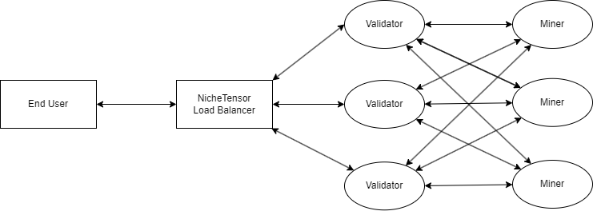

# Validator Inference Network

As a validator it is easy to join the Validator Inference Network - which allows you to get paid for each image you generate.

## Payment
If you join the Validator Inference Network, you get paid for each image you generate.

The default price is 1000 usd per one million images.

A validator with 100 000 Tao has the right to generate two million images per week (10 images per minute per miner), which corresponds to 2000 usd per week.

While these number are indicative of future demand, current demand for the network is lower since it was recently launched.

Payments to your validator are done on a weekly basis and can be made in Tao or USDT. You can choose to have it be transfered to your validator or to another address.

NicheTensor facilitates the transactions, but we do not currently take any cut, meaning that everything we get in payment from clients, goes directly to the validators participating in the Validator Inference Network.

## How to Join The Validator Inference Network
It is very easy to join the Validator Inference Network, just specify --proxy.port when starting the validator.

This starts a fastAPI server that allows requests from our load balancer to go through your validator.

Your validator proxy automatically count how many requests you get, so you can see how much you should get paid.

The default path for this is in the .bittensor folder in your validator space space.

You can see the logs by running this from the roots folder where you installed Bittensor:

```bash
cat .bittensor/miners/<wallet_name>/<hotkey_name>/netuid23/validator/proxy_counter.json
```

Replace <wallet_name> with the name of your wallet, and <hotkey_name> with the name of your hotkey.

If you get `No such file or directory` error, double check that you are in the folder where you installed bittensor.

The logs should look something like this:

{
    "2024-01-08": {"success": 34534, "fail": 0},
    "2024-01-09": {"success": 24443, "fail": 0},
    "2024-01-10": {"success": 34533, "fail": 0}
}

This shows how many request you got for each date.

## Technical Description of the Validator Inference Network

The structure is rather simple. Clients that wants to generate images queries our load balancer, which then queries a validator. Validators will get images in relation to how much stake they have, meaning that more stake gives more images.

